# Wazuh SIEM Homelab Project

# About This Project

I built this project to learn how SIEM tools work in a real environment. I have been learning cybersecurity and wanted to get hands-on experience with log monitoring, custom rule writing, and threat detection. I used Wazuh because it is open source and widely used in the industry.

The idea was simple i.e to set up Wazuh on a Ubuntu VM, connect a Windows VM as an agent, and then detect real attack techniques like PowerShell obfuscation and unauthorized file changes.


## Environment Setup

I used VirtualBox to create two virtual machines on the same host machine:

| Machine | OS | Role |
|--------|-----|------|
| VM 1 | Ubuntu | Wazuh Manager + Indexer + Dashboard |
| VM 2 | Windows | Wazuh Agent |

Both VMs were connected to the same internal network in VirtualBox so they could communicate with each other.


## How Wazuh Components Work Together

| Component | Role |
|-----------|------|
| Wazuh Manager | Receives logs from agents, applies rules, generates alerts |
| Wazuh Indexer | Stores all logs and alert data |
| Wazuh Dashboard | Visual interface where alerts and events are viewed in browser |
| Wazuh Agent | Installed on Windows VM — collects logs and sends to manager |

The flow works like this:

```
Windows VM (Agent)
        │
        │  Sends logs to Manager
        
Ubuntu VM (Wazuh Manager)
        │
        │  Applies rules, generates alerts
        
Wazuh Indexer stores data
        │

Wazuh Dashboard displays alerts
```

---

## Wazuh Installation on Ubuntu VM

I followed the official Wazuh 4.14.5 documentation to install all three components together using the installation script:

```bash
curl -sO https://packages.wazuh.com/4.14/wazuh-install.sh
curl -sO https://packages.wazuh.com/4.14/config.yml
```

Added my Ubuntu VM IP address in config.yml then ran:

```bash
sudo bash wazuh-install.sh -a
```

Once installation completed the terminal displayed auto-generated login credentials at the end:

```
INFO: --- Summary ---
INFO: You can access the web interface https://<YOUR_IP>
    User: admin
    Password: <auto-generated-password>
```

I used these credentials to log in to the Wazuh Dashboard and changed the password after first login.

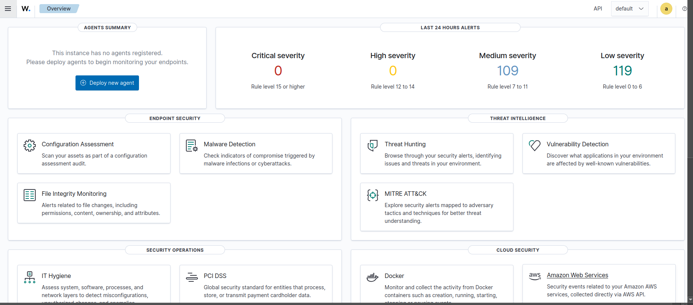

---

## Wazuh Agent Setup on Windows VM

### Step 1 - Downloaded Wazuh Agent

```powershell
Invoke-WebRequest -Uri https://packages.wazuh.com/4.x/windows/wazuh-agent-4.14.5-1.msi -OutFile wazuh-agent.msi
```

Then ran the MSI installer and entered the Ubuntu VM IP address as the Manager IP during setup.

### Step 2 - Installed Sysmon for Better Visibility

Sysmon is a Windows system monitoring tool that provides much more detailed logs than Windows alone i.e including process creation, network connections, and file changes. Without Sysmon the visibility into what is happening on the Windows machine is very limited.

I downloaded the Sysmon zip file from the Microsoft Sysinternals website and used the SwiftOnSecurity config which is the most widely used Sysmon configuration in the security community.

```powershell
.\Sysmon64.exe -accepteula -i sysmonconfig.xml
```

### Step 3 - Started Wazuh Agent

Opened services.msc on Windows, found the Wazuh service and started it. After a minute the agent appeared as Active in the Wazuh Dashboard.

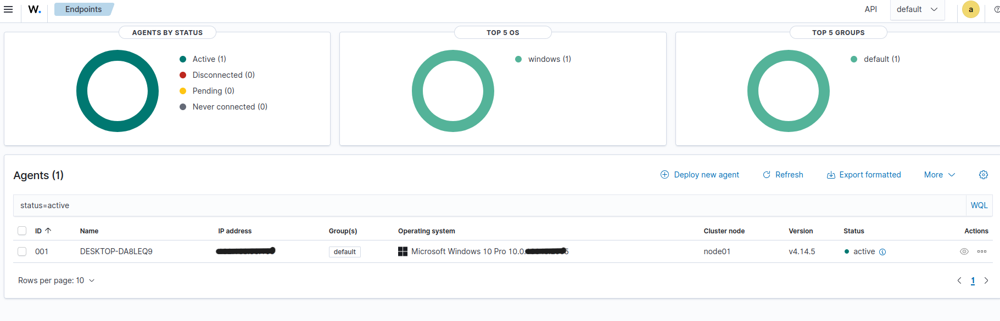

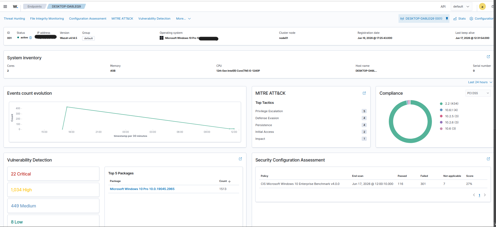

---

## Use Case 1 - PowerShell Encoded Command Detection

### Why I Chose This

PowerShell's -EncodedCommand flag is a legitimate feature that can be abused to hide malicious scripts from basic detection. I chose this as a learning exercise to understand how custom Wazuh rules work and how to detect suspicious patterns in Windows event logs. 

### Step 1 - Enabling Script Block Logging on Windows

Enabled PowerShell Script Block Logging via Windows Registry to log all PowerShell activity under Event ID 4104:

```
Path: HKLM:\SOFTWARE\Policies\Microsoft\Windows\PowerShell\ScriptBlockLogging
Value: EnableScriptBlockLogging = 1
```

### Step 2 - Configuring Agent to Collect PowerShell Logs

Opened ossec.conf on Windows VM at:

```
C:\Program Files (x86)\ossec-agent\ossec.conf
```

Added this block to collect PowerShell event logs and forward them to the Wazuh Manager on Ubuntu:

```xml
<localfile>
  <location>Microsoft-Windows-PowerShell/Operational</location>
  <log_format>eventchannel</log_format>
</localfile>
```

Restarted Wazuh service via services.msc.

### Step 3 - Writing Custom Detection Rule on Ubuntu

Opened the custom rules file on Ubuntu:

```bash
sudo nano /var/ossec/etc/rules/local_rules.xml
```

Added this rule to detect base64 encoded PowerShell command:

```xml
<group name="windows,powershell,">

  <rule id="100010" level="12">
    <if_group>windows</if_group>
    <field name="win.eventdata.scriptBlockText" type="pcre2">(?i)(-enc|-encodedcommand)</field>
    <description>PowerShell encoded command detected - possible obfuscation attempt</description>
    <mitre>
      <id>T1059.001</id>
      <id>T1027</id>
    </mitre>
  </rule>

</group>
```

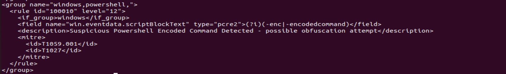

Restarted Wazuh Manager:

```bash
sudo systemctl restart wazuh-manager
```

### Step 4 - Testing and Alert

Ran a safe encoded PowerShell test command on the Windows VM. The alert fired in the Wazuh Security Events dashboard with rule ID 100010.

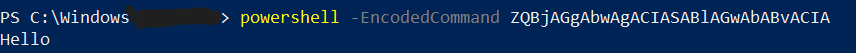

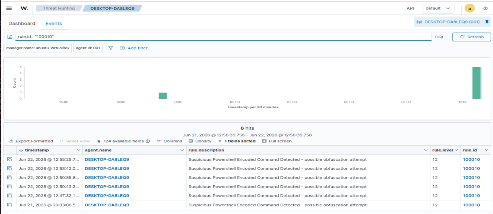

## What I would do after this alert PowerShell Encoded Command Detection fires 
When rule 100010 fires I would not immediately block or kill anything. First I would investigate i.e:

1. I will look at the alert details in Wazuh to see exactly what command was run
2. I will try to decode the command as -EncodedCommand use base64 encoding.
3. I will check which user account ran the command, at what time and would also check if this user is supposed to run this command. 
4. I would also try to check which process spawned the PowerShell instance.
5. If the command looks malicious then I would isolate the machine and would escalate this incident
6. If the command was genuine meaning it was run for some legit work then I would tune the rule to reduce false positives

**Note:** This is my own thought process based on what I have learned so far. This may not be the exact process followed in real SOC environment.

---

## Use Case 2 - File Integrity Monitoring (FIM)

### Why I Chose This

Attackers often drop malware in specific Windows folders to modify system files or to maintain persistence or redirect traffic. FIM detects these changes in real time.

### Step 1 - Configured Monitored Directories on Windows

Added the directories which attackers coomonly use inside the syscheck block in ossec.conf:

```xml
<syscheck>
  <frequency>43200</frequency>
  <disabled>no</disabled>

  <directories check_all="yes" report_changes="yes" realtime="yes">C:\Windows\Temp</directories>
  <directories check_all="yes" report_changes="yes" realtime="yes">C:\Windows\System32\drivers\etc</directories>
  <directories check_all="yes" report_changes="yes" realtime="yes">C:\ProgramData\Microsoft\Windows\Start Menu\Programs\Startup</directories>
  <directories check_all="yes" report_changes="yes" realtime="yes">C:\Users\Public</directories>

</syscheck>
```

| Folder | Why Attackers Use It |
|--------|---------------------|
| C:\Windows\Temp | This is the common location to drop malware |
| C:\Windows\System32\drivers\etc | Hosts file, the attackers modify it for DNS hijacking |
| Startup folder | For Persistence i.e for eg malware runs on every reboot |
| C:\Users\Public | Shared folder abuse |

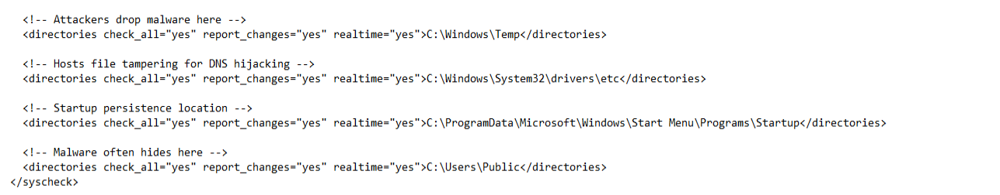

### Step 2 - Write Custom FIM Rules on Ubuntu

Added FIM detection rules to local_rules.xml:

```xml
<group name="windows,fim,syscheck,">

  <rule id="100020" level="12">
    <if_sid>554</if_sid>
    <description>FIM - New file created in suspicious location: $(syscheck.path)</description>
    <mitre>
      <id>T1565</id>
    </mitre>
  </rule>

  <rule id="100021" level="12">
    <if_sid>550</if_sid>
    <description>FIM - File modified in suspicious location: $(syscheck.path)</description>
    <mitre>
      <id>T1565</id>
    </mitre>
  </rule>

  <rule id="100022" level="12">
    <if_sid>553</if_sid>
    <description>FIM - File deleted in suspicious location: $(syscheck.path)</description>
    <mitre>
      <id>T1565</id>
    </mitre>
  </rule>

</group>
```

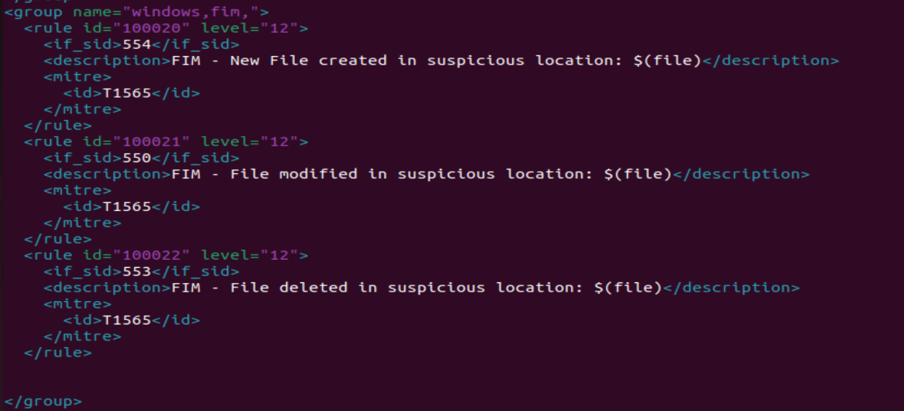

Restarted Wazuh Manager:

```bash
sudo systemctl restart wazuh-manager
```

### Step 3 - Testing and Alert

I Created, modified and deleted a test file in a monitored directory to check if the detection rule is working or not and All three events appeared as alerts in the Wazuh Threat Hunting section.

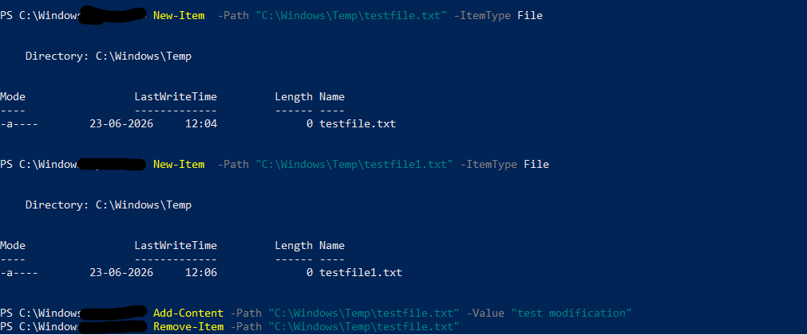

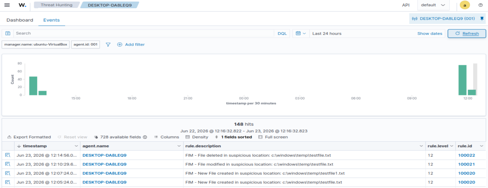

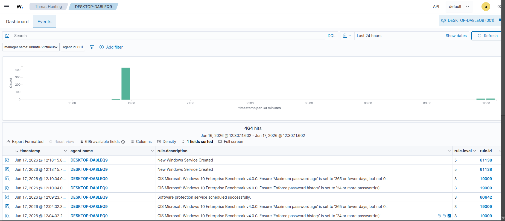

## What I would do after the FIM(File Integrity Monitoring) alert is detected

 Since the custom detection rule specifically monitors directories that attackers commonly use so When a file is created, modified or deleted in these folders so it seems to be already suspicious so if this alert is fired I would :

1. Check which specific directory triggered the alert and what exactly happened i.e if the file was created, modified or deleted.
2. Check which user made the change and at what time.
3. Check if there are any other alerts from the same machine around the same time. 
4. Check the file hash on platforms like VirusTotal.
5. If confirmed malicious , I would isolate the machine and escalate the incident.
6. If it is genuine then I would mark it as false positive and tune the rule to reduce false positives

 **Note:** This is my own thought process based on what I have learned so far. This may not be the exact process followed in real SOC environment.
 
---

## MITRE ATT&CK Coverage

| Technique ID | Technique Name | Detected By |
|-------------|---------------|------------|
| T1059.001 | PowerShell | Rule 100010 |
| T1027 | Obfuscated Files or Information | Rule 100010 |
| T1565 | Data Manipulation | Rules 100020, 100021, 100022 |

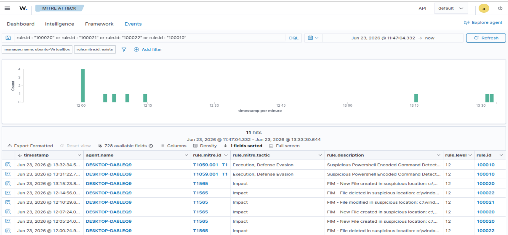

---

## What I Learned

- How to set up Wazuh SIEM from scratch on Ubuntu using VirtualBox
- How Wazuh Manager, Indexer and Dashboard work together as a complete SIEM platform
- How to connect a Windows agent to the Wazuh manager
- How to write custom detection rules using Wazuh rule syntax and PCRE2 regex
- How FIM works and why monitoring specific directories matters
- How to map detections to the MITRE ATT&CK framework

---

## Tools Used

| Tool | Purpose |
|------|---------|
| VirtualBox | Virtualization platform |
| Wazuh 4.14.5 | SIEM platform |
| Ubuntu | Wazuh Manager, Indexer and Dashboard |
| Windows | Wazuh Agent |
| Sysmon + SwiftOnSecurity Config | Enhanced Windows visibility |
| OpenSearch | Log indexing and dashboard backend |
| PowerShell | Attack simulation |

---

## References

- Wazuh Documentation — https://documentation.wazuh.com
- MITRE ATT&CK Framework — https://attack.mitre.org
- Sysmon — https://learn.microsoft.com/en-us/sysinternals/downloads/sysmon
- SwiftOnSecurity Sysmon Config — https://github.com/SwiftOnSecurity/sysmon-config

## Author

- Krishna Mali [Aspiring SOC Analyst]
